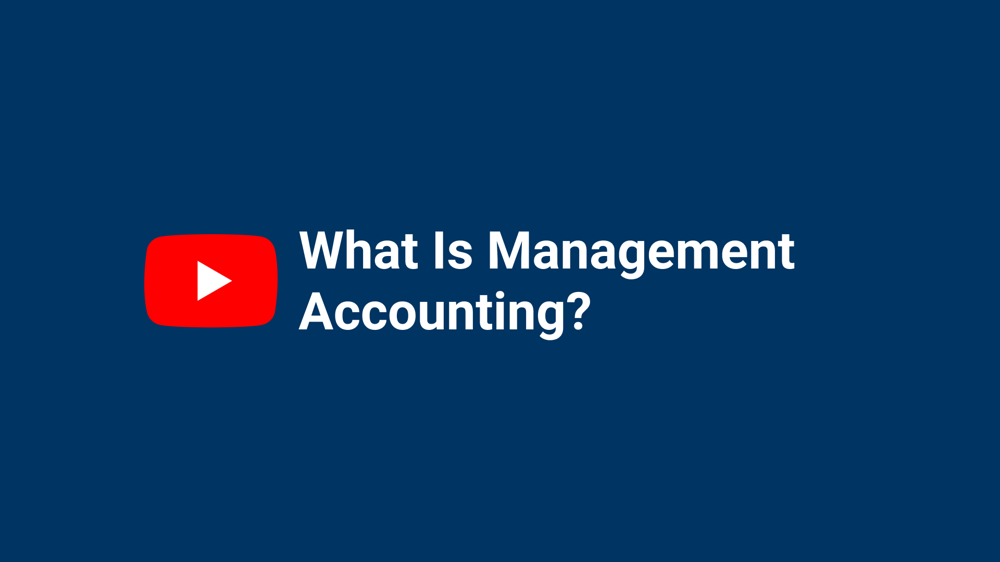
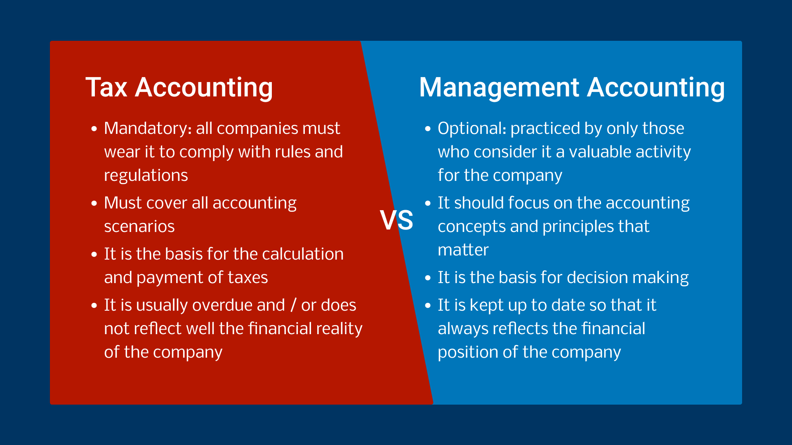
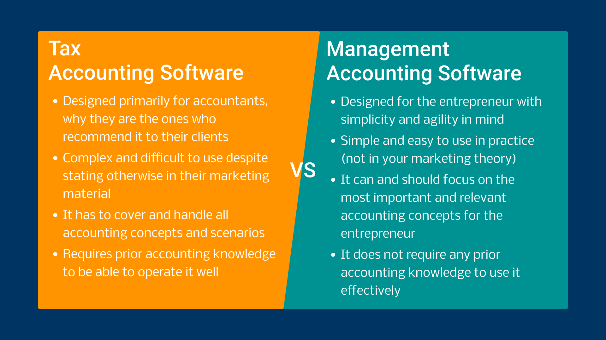
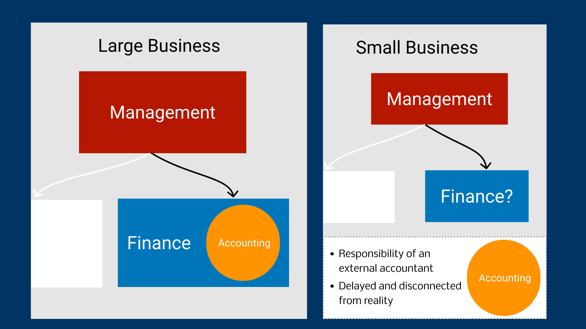

## What Is Management Accounting?

If you prefer, you can watch this video with the summary presentation of this article.

Hello, my name is Federico and I am one of the creators of myAbakus.

Instead of trying to demo the software to you in 3 minutes (which is impossible) or present you with a graphical animation so you understand what you can do with it (which is hot), I am going to explain why that exists and its position in the accounting software market.

I decided to do this because I am convinced that with just this explanation, you will be able to determine if myAbakus is aligned with what you need and are looking for for your company, without having to create an account and test the software. In other words, creating an account and evaluating the software only makes sense, if you agree with our point of view on the market and have the problem that our product is focused on solving.

With this clear, let's get down to business.

The point or principle from which we must begin is that in the world there are two types of accounting: tax accounting and what I call managerial accounting. Tax accounting does not require much explanation: all companies are required to do it in order to meet their tax obligations. Managerial accounting, on the other hand, is to control and understand the finances of a company and to support decision-making.

Someone could say that I am inventing a division that does not exist and that accounting is only one and is used for both the fiscal and managerial part. That argument could perhaps be valid in a large company, but you and I know that in the real world of small companies it does not apply. In fact, managerial accounting is not required or practiced in most small businesses, and tax accounting does not always adequately reflect the financial situation of a small or medium-sized business.

> Management accounting is not required or practiced in most small businesses, and tax accounting does not always adequately reflect the financial situation of a small or medium-sized business.

So, the first point that we have to agree on to make it worthwhile for you to continue reading this article is that there are two types of accounting (fiscal and managerial) that solve different problems. Assuming that's the case and I still have your attention, the logical step to take is to explain the difference between tax accounting software and management accounting software.

Tax accounting software has one main feature that is very clear and obvious when using it: it is designed for the accountant. This in addition to being evident, goes against all the arguments that are made about simplicity and ease of use in the marketing material.

Now this is certainly the right strategy for an accounting software company that wants to maximize its reach and market share. Why accountants are the main distribution channel for accounting software through the recommendations they make to their clients which software to use.

Therefore, the most important person to the accounting software company is not you as the end user, but the accountant as agent and distributor. And that explains why accounting software companies often give the software to accountants and make it easier for them to manage their clients' accounts.

> The most important person to the accounting software company is not you as the end user, but the accountant as agent and distributor.

Despite being very successful, this model has a clear weakness that we want to exploit. And the fact is that the work, the needs and the preferences of the accountant are very different from those of the employer. Therefore, our position in the accounting software market is to offer software that is clearly designed for the entrepreneur and focuses on the needs of him (not those of the accountant).

The counterargument of any accounting software company is going to be that their product does not have that problem because both accountants and end users "love" it. We are not convinced by that argument and we see that most end users are simply following their accountant's recommendations on what software to use.

The reality is that it is very difficult to create a product that is going to be very satisfactory for both accountants and entrepreneurs, for the simple reason that they have very different idiosyncrasies and needs. That is why we decided that our software would put the needs of the entrepreneur as the basis for its design and functionality. And stay focused on accounting concepts and processes that are valuable to the entrepreneur.

> It is very difficult to create a product that is going to be very satisfactory for both accountants and entrepreneurs, for the simple reason that they have very different idiosyncrasies and needs.

It does not matter if these concepts and processes only cover 20% of the accounting universe. Well, at the end of the day the 80/20 law applies here and only the most important 20% is what you need to understand and put into practice so that accounting goes from being another problem to be solved to becoming a valuable tool for your business. 

Basically, we aspire to be the best option in the market for those entrepreneurs who want to practice managerial accounting and let the accountant take care of the tax part. And we do not care that the universe of potential users for a management accounting software is much smaller than that of potential users for a tax accounting software.

Remember my previous point that all companies have to do tax accounting, but few actually practice managerial accounting, especially when it comes to small and medium-sized businesses. A good way to understand this reality is to examine what happens in a large company, where there is usually an accounting department separate from the finance department.

It is clear that both departments belong to the same organizational area and work together. But the finance department in a large company is the one that usually plans and makes financial decisions, using as a basis the information produced by the accounting department.

> The finance department in a large company is the one that usually plans and makes financial decisions, using as a basis the information produced by the accounting department.

In a small business, where resources are often limited, the accounting department's role is filled by an outside accountant. And the function of the finance department usually does not exist because the owner of the company does not have the will or the tools to put it into practice.

> In a small business, the accounting department role is filled by an external accountant and the finance department role is often non-existent.

Also remember that the information that the accountant handles is often out of date, may not be adjusted to reality and may not be useful or easy to interpret for the employer. That is why we want to invite you to establish the role of the finance department in his company by implementing our software and using it regularly. 

We want our software to become the source of the financial reality of your company with clear, orderly and up-to-date accounts. And that in addition to being a useful tool in the daily management of your company, it allows you to clearly understand your financial position and make decisions to improve it.

Finishing and going back to what I said at the beginning of the video, it makes no sense for you to create an account and test our software, if your reality and the problem you are trying to solve are different from what I just explained to you. In fact, a good test of the affinity between our software and your needs is that there is nothing new or novel in everything I just told you. It is a reality that is part of his own experience and the only thing I have done here is articulate it so that it is clearer and more evident.

So if the financial control of your company is important to you and managerial accounting is more of a necessity than a good idea, we invite you to create your account and evaluate our software. But knowing that you are going to entrust your accountant with the only thing he can and should do: make sure that your company complies with all the relevant rules and regulations.

We are not fighting with your accountant and our software can export your information in the format that is easiest for him or her to consume. But if what you are trying to solve is a tax problem, following the recommendations and preferences of your accountant, it is clear that our software is not going to be the best option and it is not worth spending time trying it.

Thank you very much for your attention and for taking the time to read this article, and I hope that beyond being informative, it has been helpful in deciding what type of accounting software is right for your company. 

